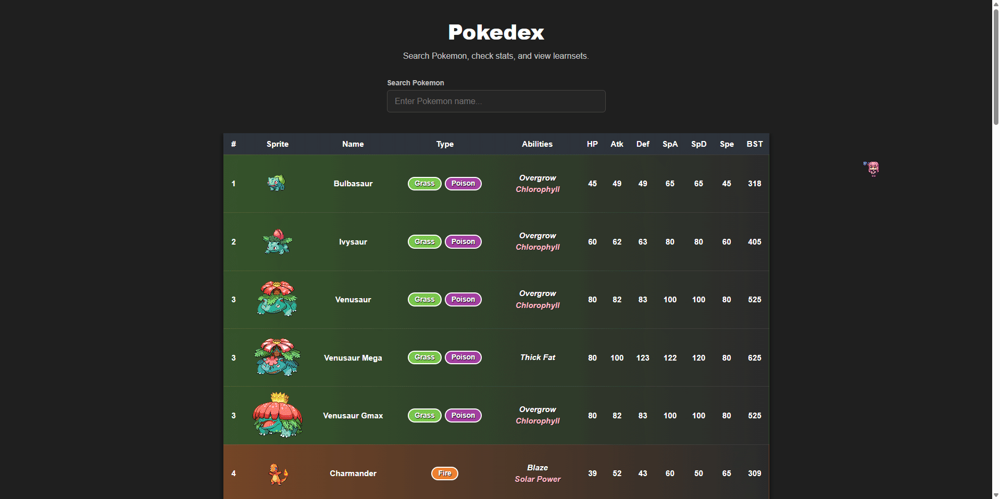
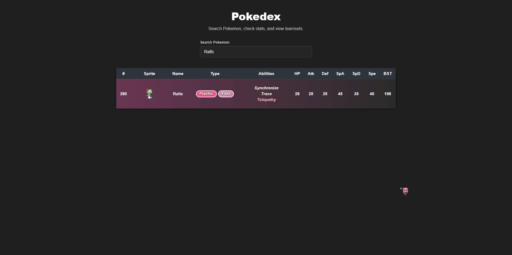
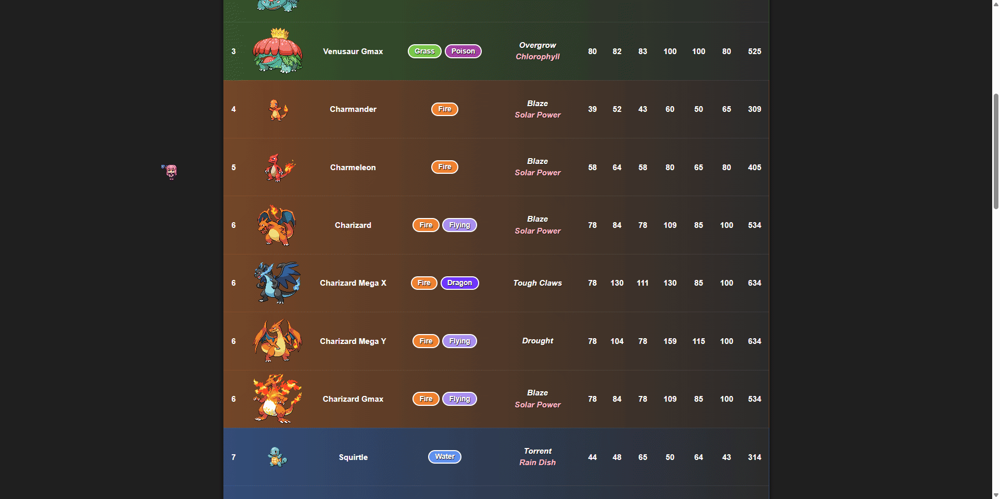

# Pokedex App
Full Stack Pokedex app created using React framework for the Front End and FastAPI for the backend.
This project is expanded on from my previous Pokedex project from my Web Programming I class which can be found [HERE](https://github.com/tan00139/pokedex-class-project).

## Features

### Main Pokédex Table
Displays Pokémon in a table layout with their pokedex number, sprite, name, typings, abilities, and base stats.

### Search Function
Search for Pokémon by name or Pokédex number with live results.

### Pokémon Details Modal
Click a Pokémon to view detailed information, including abilities, base stats, type weaknesses, moves, and evolution details.

### Evolution Navigation
Click Pokémon inside the evolution chain to load related Pokémon entries without leaving the modal.

## Future Planned Features

- Add user authentication for saving favorite pokemons and custom teams
- Build a pokemon team builder with team editing & storage
- Add advanced search filters for pokemon type, base stat totals, abilities
- Add sorting option for Pokedex number or base stat totals

